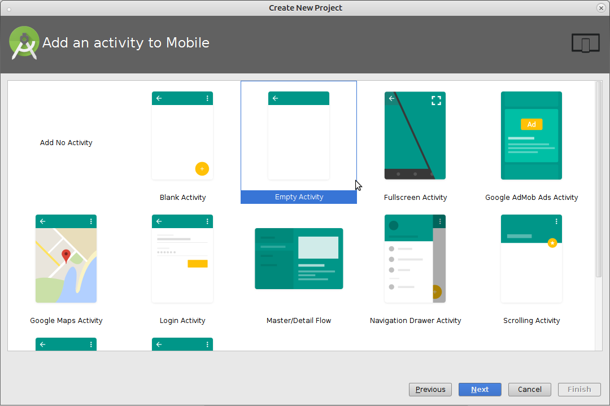
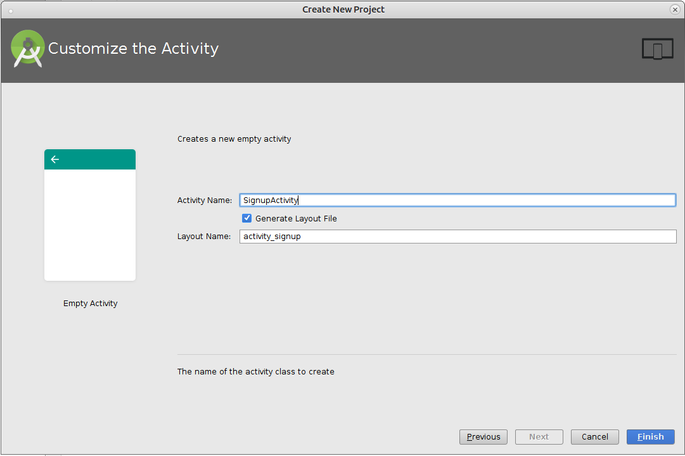
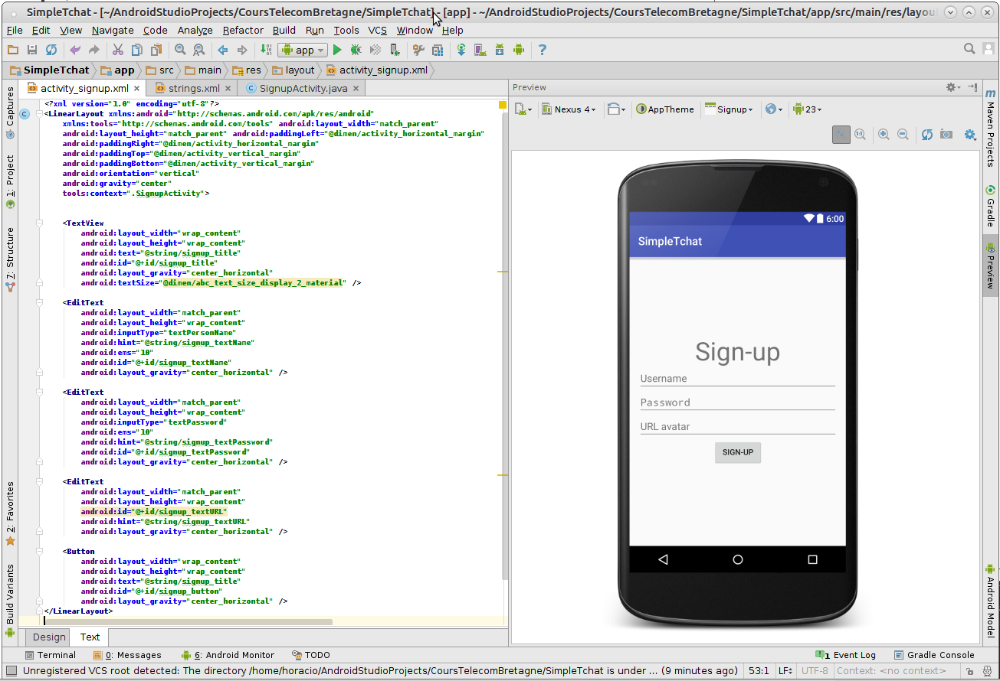

## Simple Tchat

This project is a teaching support for an introductory course to Android
development.

The tutorial relies on the use of the [Git](http://git-scm.com/) versioning system for source code management. You don't need to know anything about Git to follow the tutorial other than how to install and run a few git commands.


### Step-00: Create project

You begin a new project, `SimpleTchat`.


You choose to begin with an empty activity.



You call the activity `SignupActivity`.



And you have the new project in the IDE.


### Step-01: Create the activities

Reset the workspace to step-1.

```
git checkout -f step-01
```

In this step you're going to create the three main Activities for the SimpleTchat:
`SignupActivity`, `SigninActivity` and `MessageActivity`:



For each Actitity you create the UI widgets, you give them unique ID and you
externalize all the strings.


